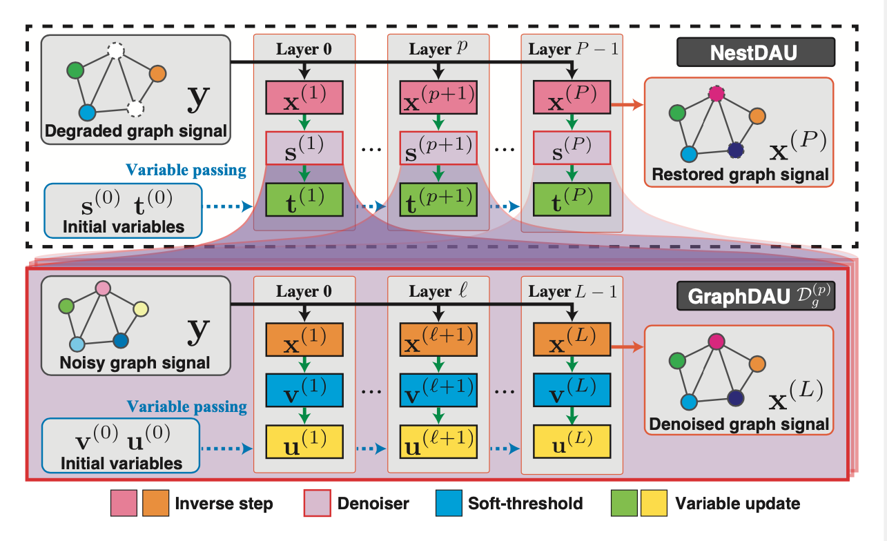

# Graph Signal Restoration Using Nested Deep Algorithm Unrolling


<center>
**This article is accepted to "IEEE Transactions on Signal Processing"**.

[[Paper Link]](https://ieeexplore.ieee.org/stamp/stamp.jsp?arnumber=9796141)
[[Project Page]](https://mnagaa.github.io/graph-signal-restoration-using-nested-deep-algorithm-unrolling/)
</center>

## Abstract:
Graph signal processing is a ubiquitous task in many applications such as sensor, social, transportation and brain networks, point cloud processing, and graph neural networks.
Often, graph signals are corrupted in the sensing process, thus requiring restoration. In this paper, we propose two graph signal restoration methods based on deep algorithm unrolling (DAU).
First, we present a graph signal denoiser by unrolling iterations of the alternating direction method of multiplier (ADMM).
We then suggest a general restoration method for linear degradation by unrolling iterations of Plug-and-Play ADMM (PnP-ADMM).  In the second approach, the unrolled ADMM-based denoiser is incorporated as a submodule, leading to a nested DAU structure.
The parameters in the proposed denoising/restoration methods are trainable in an end-to-end manner.
Our approach is interpretable and keeps the number of parameters small since we only tune graph-independent regularization parameters.
We overcome two main challenges in existing graph signal restoration methods: 1) limited performance of convex optimization algorithms due to fixed parameters which are often determined manually. 2) large number of parameters of graph neural networks that result in difficulty of training.
Several experiments for graph signal denoising and interpolation are performed on synthetic and real-world data.
The proposed methods show performance improvements over several existing techniques in terms of root mean squared error in both tasks.

## Deep Algorithm Unrolling


 Conventional iterative optimization algorithm (left) and deep algorithm unrolling (right).

## Proposed Method


Overview of GraphDAU and NestDAU for graph signal restoration. The top represents NestDAU: General restoration based on PnP-ADMM. The bottom
represents GraphDAU: Denoiser based on ADMM. GraphDAU can be used as the off-the-shelf denoiser in NestDAU.

## Experimental Result

### Denoising


### Interpolation


## Usage (Sample code)

This code is available on `AMD64` architecture.

```shell
$ portry install

# setup dataset
$ portry run python dataset/setup.py

# execute denosing signals on community graph
$ poetry run python scripts/denoising_community.py
```

## Citation

```bibtex
@article{nagahama2022GraphSignal,
  title = {Graph Signal Restoration Using Nested Deep Algorithm Unrolling},
  author = {Nagahama, Masatoshi and Yamada, Koki and Tanaka, Yuichi and Chan, Stanley H. and Eldar, Yonina C.},
  year = {2022},
  journal = {IEEE Transactions on Signal Processing},
  volume = {70},
  pages = {3296--3311}
}
```
